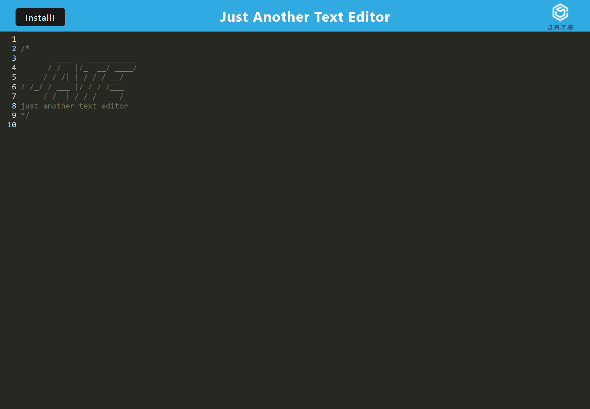

# PWA-Text-Editor

## Table of Contents
1. [Description](#description)
2. [Installation](#installation)
3. [Usage](#usage)
4. [Contributing](#contributing)
5. [Tests](#tests)
6. [LIcense](#lIcense)
7. [Questions](#questions)

## Description
This progressive web application uses IndexedDB for the database, Webpack to bundle the front-end, Workbox for the service worker used to cache static assets, and Heroku for the deployement host. Users can install this application to use offline or access it online [HERE](https://shielded-dusk-65024-10dd3e0a24e8.herokuapp.com/).
## Installation
npm install for dependencies
## Usage
1.Go to the root directory of your project
2.Enter npm run build to bundle front-end code
3.Run the server, enter npm run start
4.Go to localhost PORT
5.CLick 'install' to install application or use live [HERE](https://shielded-dusk-65024-10dd3e0a24e8.herokuapp.com/).
## Contributing
fork, code, pull req.
## Tests
none
## License
Checkouthttps://mit-license.org/for this project license information.
## Questions
Checkout other projects [HERE](https://github.com/Lennylettuce/PWA-Text-Editor) on Github 